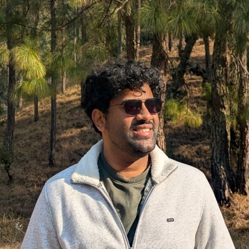

# Hi there! I'm Siddhant, an AI/ML researcher and engineer from NYU and IIT.

I specialize in **efficient AI systems, LLM optimization, quantization, and computer vision**.  
I am graduating in **May 2026** and actively seeking **AI/ML Engineer and Applied Research roles**.

<link rel="stylesheet" href="assets/custom.css">

  

    <h1>Hi there! I'm Siddhant, an AI/ML researcher and engineer from NYU and IIT.</h1>

    

      I specialize in <strong>efficient AI systems, LLM optimization, quantization, and computer vision</strong>.
      I am graduating in <strong>May 2026</strong> and actively seeking AI/ML Engineer and Applied Research roles.
    

    

      <a class="btn fa-btn email" href="mailto:siddhantmohan1110@gmail.com">
        <i class="fas fa-envelope"></i> Email
      </a>

      <a class="btn fa-btn github" href="https://github.com/siddhantmohan1110" target="_blank">
        <i class="fab fa-github"></i> GitHub
      </a>

      <a class="btn fa-btn linkedin" href="https://www.linkedin.com/in/siddhant-mohan-1110/" target="_blank">
        <i class="fab fa-linkedin"></i> LinkedIn
      </a>

      <a class="btn fa-btn resume" href="Siddhant_Mohan_CV_AI.pdf" target="_blank">
        <i class="fas fa-file"></i> Resume
      </a>
    

  

  

    
  

---

## 🚀 Key Projects

### Distribution-Aware Companding Quantization (DACQ)
Developed a lightweight **post-training quantization framework for LLMs** that models layer-wise weight distributions and applies non-uniform companding for efficient bit allocation. Integrated activation-aware scaling to preserve downstream accuracy on models such as LLaMA and Qwen.

**Stack:** PyTorch • HuggingFace • CUDA • Statistical modeling

---

### Efficient Data Pipelines for Vision–Language Models
Clustered prompt embeddings for hybrid autoregressive transformers to reuse lower-scale generated images and reduce redundant computation. Improved computational efficiency through embedding clustering and distributed experimentation.

**Stack:** PyTorch • Ray • HPC (Slurm)

---

### Core-Set Selection for Incremental Learning
Analyzed dataset characteristics to construct compact core-sets that preserve downstream model performance during incremental updates, improving memory efficiency without significant accuracy degradation.

**Stack:** PyTorch • Data analysis • Model evaluation

---

## 💼 Work Experience

### Senior Research Engineer — Toshiba Software India (R&D)
*2019 – 2024*

Led applied AI research projects in industrial computer vision and manufacturing systems.

- Developed incremental learning pipelines for object detection systems.
- Built anomaly localization systems evaluated on MVTec-AD.
- Designed domain adaptation solutions for robotic and inspection environments.
- Optimized deep learning pipelines under compute and latency constraints.

---

## 🎓 Education

### New York University (NYU) Tandon School of Engineering
**M.S. Electrical Engineering** — Expected May 2026  
Coursework: Machine Learning, Deep Learning, Computer Vision, NLP, Efficient AI, Probability & Statistics

---

### Indian Institute of Technology (IIT) Tirupati
**B.Tech. Electrical Engineering** — 2020  

---

## 🛠 Technical Skills

**Languages:** Python, C/C++, SQL  
**Frameworks:** PyTorch, TensorFlow, HuggingFace, Ray, MLflow  
**Systems:** CUDA, Distributed Training, Docker, Linux, Slurm  
**Focus Areas:** LLM Optimization, Quantization, Efficient AI Systems, Computer Vision