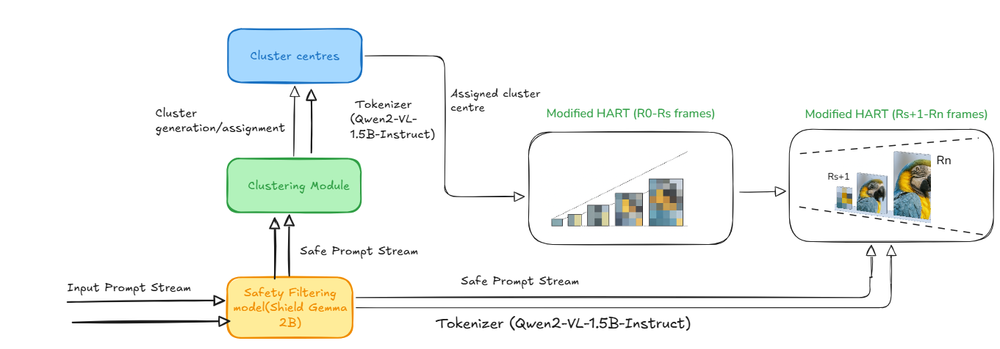

<link rel="stylesheet" href="assets/custom.css">
<link rel="stylesheet" href="https://cdnjs.cloudflare.com/ajax/libs/font-awesome/6.4.0/css/all.min.css"/>

Applied AI/ML Research Engineer with <strong>4 years of work experience</strong> and an M.S. from NYU (graduated May 2026). Passionate about building efficient, state-of-the-art machine learning and computer vision systems. Actively seeking <strong>AI/ML Engineer and Research Scientist</strong> roles.

  <a class="btn fa-btn email" href="mailto:siddhantmohan1110@gmail.com">
    <i class="fa-solid fa-envelope"></i> Email
  </a>

  <a class="btn fa-btn github" href="https://github.com/siddhantmohan1110" target="_blank" rel="noopener">
    <i class="fa-brands fa-github"></i> GitHub
  </a>

  <a class="btn fa-btn linkedin" href="https://www.linkedin.com/in/siddhant-mohan-1110/" target="_blank" rel="noopener">
    <i class="fa-brands fa-linkedin"></i> LinkedIn
  </a>

  <a class="btn fa-btn resume" href="Siddhant_Mohan_Resume.pdf" target="_blank" rel="noopener">
    <i class="fa-regular fa-file-lines"></i> Resume
  </a>

---

## Academic Projects

My graduate projects at NYU showcasing expertise in efficient AI and modern machine learning systems, including vision-language models, large language models, retrieval-augmented generation (RAG) and diffusion models.

### Distribution-Aware Companding Quantization (DACQ)

  <a class="btn fa-btn paper" href="https://arxiv.org/abs/2603.00364" target="_blank" rel="noopener">
    <i class="fa-regular fa-file-lines"></i> Paper
  </a>

  <a class="btn fa-btn github" href="https://github.com/siddhantmohan1110/dacq" target="_blank" rel="noopener">
    <i class="fa-brands fa-github"></i> GitHub
  </a>

DACQ is a post-training quantization method for large language models that uses distribution-aware companding to better preserve model weights under low-bit precision. It aims to improve upon Activation Aware Quantization (AWQ) by using non-uniform quantization bins based on the distribution instead of uniform quantization bins. The project studies the trade-off between weight reconstruction error, benchmark performance, and deployment efficiency across LLMs like Llama3-8B and Qwen2.5-7B, using benchmark datasets such as MMLU and WikiText-2. It **reduces weight reconstruction error (MSE/MAE) by 20%** compared to AWQ, while maintaining competitive accuracy and perplexity.

**Stack:** PyTorch • HuggingFace • CUDA • HPC (Slurm) • Statistical Modeling  

**Models:** Llama3-8B • Qwen2.5-7B

**Datasets:** MMLU • WikiText-2

**Keywords:** LLM Optimization • Post-Training Quantization • Companding • Efficient AI • Model Compression

---

### Efficient Vision-Language Generation with Semantic Prompt Clustering on HART

  <a class="btn fa-btn github" href="https://github.com/siddhantmohan1110/hart-v2" target="_blank" rel="noopener">
    <i class="fa-brands fa-github"></i> GitHub
  </a>

Designed an efficient generation pipeline for Hybrid Autoregressive Transformer (HART), which produces images through low-resolution generation followed by multiple autoregressive refinement stages.  
The project reduces redundant early-stage computation by clustering semantically similar prompts, sharing their coarse visual generation, and reintroducing prompt-specific conditioning during later refinement.

**Stack:** PyTorch • HuggingFace • HDBSCAN • CUDA • HPC (Slurm)

**Model:** Hybrid Autoregressive Transformer (HART)

**Datasets:** ImageNet-1K • MJHQ-30K

**Keywords:** Vision-Language Generation • Efficient Generative AI • Prompt Clustering • Autoregressive Refinement • Compute Reuse

#### 🚀 Results

- Reduced redundant forward passes by sharing low-resolution generation across semantically similar prompts
- Lowered compute and memory usage in the early stages of the generation pipeline
- Achieved approximately **20% improvement in computational efficiency** while maintaining generated image quality

---

## 💼 Work Experience

### Senior Research Engineer — Toshiba Software India (R&D)
*2020 – 2024*

Led applied AI research projects in industrial computer vision and manufacturing systems.

- Incremental Learning: Engineered an incremental learning pipeline for a single-shot object detector
model, using knowledge distillation and weight importance-based regularization, which enabled
adaptation to new object classes without forgetting old classes, improving mAP by 15% on COCO and VOC.
- Unsupervised Anomaly Localization: Directed a team in developing an unsupervised approach for
localizing anomalies in industrial images using feature extractors and k-nearest neighbor statistics.
Outperformed baselines on the MVTec-AD dataset by 22%.
- Domain Adaptation: Managed a project on implementing domain adaptation for key-point detection in
arc-welding images, using mix-up augmentation. Achieved an improvement of 12% over the baseline.
- Systems & Infrastructure: Configured and deployed NVIDIA GPU workstations from scratch to set up an
R&D lab, including Ubuntu, CUDA, cuDNN driver setup, PyTorch environments for deep learning,
reducing compute costs by 30% annually compared to equivalent commercial cloud usage.

---

## 🎓 Education

### New York University (NYU) Tandon School of Engineering
**M.S. Electrical Engineering** — May 2026  
Coursework: Machine Learning, Deep Learning, Computer Vision, NLP, Efficient AI, Probability & Statistics

---

### Indian Institute of Technology (IIT) Tirupati
**B.Tech. Electrical Engineering** — June 2020
Coursework: Image Processing, Medical Imaging, Digital Signal Processing, Basic Graph Theory

---

## 🛠 Technical Skills

**Languages:** Python, C/C++, SQL, MATLAB 
**Frameworks:** PyTorch, TensorFlow, HuggingFace, Ray, MLflow, OpenCV, OpenMMLab, MLFlow, Ray, Scikit-Learn, ONNX, Numpy, Scipy, Pandas, Matplotlib 
**Systems:** CUDA, Distributed Training, Docker, Linux, Slurm  
**Focus Areas:** LLM Optimization, Quantization, Efficient AI Systems, Computer Vision
