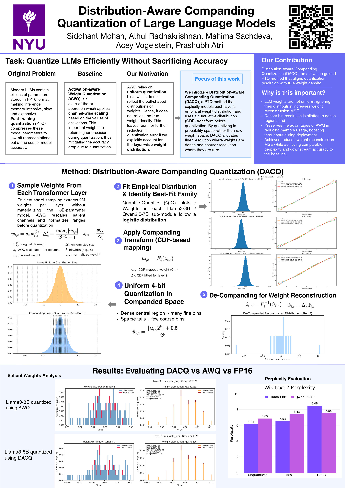

<link rel="stylesheet" href="assets/custom.css">
<link rel="stylesheet" href="https://cdnjs.cloudflare.com/ajax/libs/font-awesome/6.4.0/css/all.min.css"/>

Applied AI/ML Research Engineer with <strong>4 years of work experience</strong> and an M.S. from NYU (graduated May 2026). Passionate about building efficient, state-of-the-art machine learning and computer vision systems. Actively seeking <strong>AI/ML Engineer and Research Scientist</strong> roles.

  <a class="btn fa-btn email" href="mailto:siddhantmohan1110@gmail.com">
    <i class="fa-solid fa-envelope"></i> Email
  </a>

  <a class="btn fa-btn github" href="https://github.com/siddhantmohan1110" target="_blank" rel="noopener">
    <i class="fa-brands fa-github"></i> GitHub
  </a>

  <a class="btn fa-btn linkedin" href="https://www.linkedin.com/in/siddhant-mohan-1110/" target="_blank" rel="noopener">
    <i class="fa-brands fa-linkedin"></i> LinkedIn
  </a>

  <a class="btn fa-btn resume" href="Siddhant_Mohan_Resume.pdf" target="_blank" rel="noopener">
    <i class="fa-regular fa-file-lines"></i> Resume
  </a>

---

## Academic Projects

### Distribution-Aware Companding Quantization (DACQ)

#### 🚀 Results

- Achieves **lower reconstruction error (MSE / MAE)** than strong baselines like AWQ  
- Maintains **competitive accuracy and perplexity** on benchmarks such as MMLU and WikiText-2  
- Provides **~15–20% throughput improvement** over full-precision models while retaining most benefits of 4-bit quantization

---

**Stack:** PyTorch • HuggingFace • CUDA • HPC (Slurm) • Statistical Modeling

Paper : https://arxiv.org/abs/2603.00364

GitHub : https://github.com/siddhantmohan1110/dacq

---

### Efficient Data Pipelines for Vision–Language Models
Clustered prompt embeddings for hybrid autoregressive transformers to reuse lower-scale generated images and reduce redundant computation. Improved computational efficiency through embedding clustering and distributed experimentation.

**Stack:** PyTorch • Ray • HPC (Slurm)

---

### Core-Set Selection for Incremental Learning
Analyzed dataset characteristics to construct compact core-sets that preserve downstream model performance during incremental updates, improving memory efficiency without significant accuracy degradation.

**Stack:** PyTorch • Data analysis • Model evaluation

---

## 💼 Work Experience

### Senior Research Engineer — Toshiba Software India (R&D)
*2019 – 2024*

Led applied AI research projects in industrial computer vision and manufacturing systems.

- Developed incremental learning pipelines for object detection systems.
- Built anomaly localization systems evaluated on MVTec-AD.
- Designed domain adaptation solutions for robotic and inspection environments.
- Optimized deep learning pipelines under compute and latency constraints.

---

## 🎓 Education

### New York University (NYU) Tandon School of Engineering
**M.S. Electrical Engineering** — Expected May 2026  
Coursework: Machine Learning, Deep Learning, Computer Vision, NLP, Efficient AI, Probability & Statistics

---

### Indian Institute of Technology (IIT) Tirupati
**B.Tech. Electrical Engineering** — 2020  

---

## 🛠 Technical Skills

**Languages:** Python, C/C++, SQL  
**Frameworks:** PyTorch, TensorFlow, HuggingFace, Ray, MLflow  
**Systems:** CUDA, Distributed Training, Docker, Linux, Slurm  
**Focus Areas:** LLM Optimization, Quantization, Efficient AI Systems, Computer Vision
